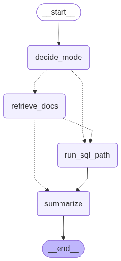

# Generative AI Multi Agent System for Customer Support

## LangGraph Orchestration Flow



---

## 1. Overview

This project implements a Generative AI powered Multi Agent System that enables natural language interaction with both structured and unstructured customer data.

The system is designed to assist a customer support executive in retrieving, analyzing, and summarizing information that is distributed across structured databases and policy documents.

Key capabilities:

- Retrieve customer profiles and ticket history from structured data sources
- Search and summarize company policy documents in PDF format
- Combine structured and unstructured information into a single contextual response
- Produce grounded, evidence-based answers to reduce hallucination risk

---

## 2. Assignment Objective Coverage

This implementation satisfies the stated assessment objectives as follows:

### Structured Data Handling

- Customer and ticket datasets stored in DuckDB
- Automatic join between customers and tickets
- Natural language to SQL translation
- Support for filtering, grouping, aggregation, and metrics (COUNT, AVG, etc.)

### Unstructured Data Handling

- PDF ingestion pipeline
- PDF to Markdown conversion using Docling
- Embedding generation and vector indexing
- Semantic retrieval using Chroma Vector Database

### Multi Agent Architecture

- LangGraph state-based orchestration
- Deterministic routing between:
  - Docs only mode
  - SQL only mode
  - Hybrid mode (Docs + SQL)
- Evidence synthesis prior to final response generation

### Technology Stack

- LangChain
- LangGraph
- Ollama (local LLM)
- DuckDB
- Chroma Vector Database
- MCP Server
- FastAPI
- Streamlit

---

## 3. System Architecture

User Interface  
→ FastAPI  
→ MCP Server  
→ LangGraph Orchestrator  
→  
 1. SQL Agent (DuckDB)  
 2. Document Retriever (Chroma Vector DB)  
→ Summarization Agent  
→ Final Response  

---

## 4. LangGraph Execution Flow

The application uses a StateGraph to coordinate execution:

1. **decide_mode**  
   Determines whether the query requires:
   - docs_only
   - sql_only
   - hybrid

2. **retrieve_docs**  
   Performs semantic retrieval from the vector database.

3. **run_sql_path**  
   Executes structured queries using the Query Interpreter and SQL pipeline.

4. **summarize**  
   Generates a grounded response using only observed evidence.

This controlled routing ensures reproducible execution paths and reduces hallucination.

---

## 5. Project Structure

```text
Code/
│
├── api.py
├── app_langgraph.py
├── ingestion.py
├── intent_llm.py
├── llm_sql_agent.py
├── mcp_server.py
├── pdf_to_markdown.py
├── sql_engine.py
├── sql_orchestrator.py
├── summarization_agent.py
├── vectorize.py
├── ui.py
└── test_mcp.py
```

---

## 6. Workflow

### Step 1: Upload Data

Required:
- customers.csv
- tickets.csv

Optional:
- Policy PDF documents

### Step 2: Session Initialization

The MCP server performs:

- Creation of a DuckDB database
- Construction of a joined view (`customer_tickets`)
- Conversion and indexing of policy documents into a vector database

### Step 3: Query Processing

LangGraph determines the appropriate execution path and produces a structured response.

---

## 7. Setup

### Prerequisites

- Python 3.10 or 3.11  
- Ollama installed locally  
- A compatible Ollama instruct model pulled  

Example model used during development:

```
qwen2.5:14b-instruct-q5_K_M
```

You may use another instruct-capable model if preferred.

---

### Installation

Create and activate a virtual environment:

```bash
python -m venv venv
source venv/bin/activate
```

Install dependencies:

```bash
pip install -r requirements.txt
```

---

### Start Ollama

Ensure Ollama is running and the required model is available:

```bash
ollama serve
ollama pull qwen2.5:14b-instruct-q5_K_M
```

---

## 8. Running the Application

### Option A: Streamlit UI (Recommended)

Start the FastAPI backend:

```bash
uvicorn Code.api:app --reload --host 127.0.0.1 --port 8000
```

In a separate terminal, launch the Streamlit interface:

```bash
streamlit run Code/ui.py
```

Open in your browser:

```
http://localhost:8501
```

Upload:
- customers.csv  
- tickets.csv  
- Policy PDF files (optional)  

You can then begin querying through the chat interface.

---

### Option B: MCP CLI Test

To validate the MCP server and orchestration without the UI:

```bash
python -m Code.test_mcp
```

This validates:

- MCP session creation  
- SQL execution  
- Document retrieval  
- LangGraph routing logic  

---

## 9. API Usage

### Endpoint

```
POST /query
```

### Request Format

Multipart form data containing:

- `question` (string)  
- `customers_csv` (file)  
- `tickets_csv` (file)  
- `pdf_files` (optional list of PDF files)  

### Example

```bash
curl -X POST "http://127.0.0.1:8000/query" \
  -F "question=How many open tickets are there?" \
  -F "customers_csv=@Data/csv/customers.csv" \
  -F "tickets_csv=@Data/csv/tickets.csv" \
  -F "pdf_files=@Data/pdfs/Refund_Returns_Policy.pdf"
```

---

## 10. Demonstration Queries

The following queries demonstrate core system capabilities:

### Basic RAG
"What is the standard delivery timeframe for domestic shipments?"

### Basic SQL
"How many total tickets does Ema Patel have in her history?"

### Hybrid Query
"Does Ema Patel have any open refund tickets, and what is the processing timeline for them?"

### Calculation
"What is the average satisfaction score for all Closed tickets?"

### Edge Case
"What is the policy for shipping to Mars?"

---

## 11. Environment Notes

This project runs entirely locally and does not require external API keys.

Ensure:

- Ollama is running  
- The selected model is available  
- Port 8000 is free for FastAPI  
- Port 8501 is free for Streamlit  

---

## 12. Limitations

- Designed for synthetic or demonstration datasets  
- Uses an in-memory session store (not persistent)  
- Runs a local LLM via Ollama  
- Vector index is stored locally  

